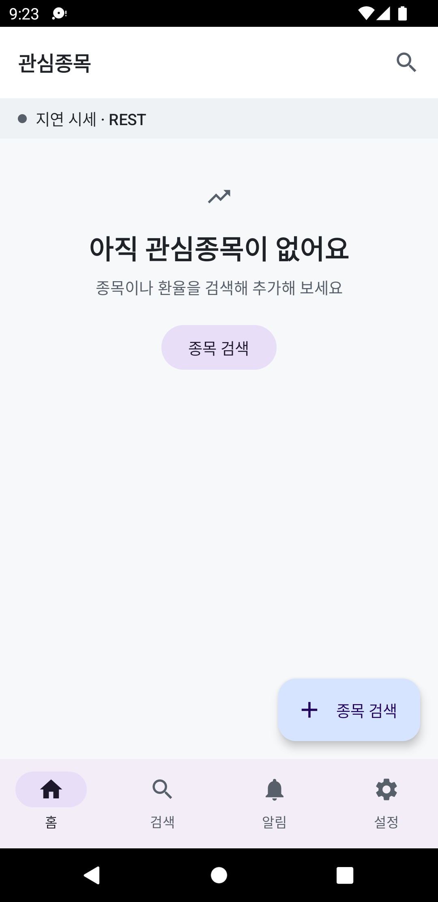

# Finnhub Quotes

Finnhub API 기반 실시간 주식/환율 시세 Android 앱.

## 주요 기능

- 실시간 시세 스트리밍(WebSocket) + 종목 검색/상세 정보(REST)
- 워치리스트에 종목을 등록하면 실시간 가격 업데이트 표시
- Finnhub 무료 티어 사용 (REST 60 req/min, WebSocket 동시 구독 50 symbols 제한 고려)

## 화면

| 워치리스트 (빈 상태) |
|---|
|  |

현재 워치리스트 화면까지 구현 완료(로딩/빈/에러/성공 상태, 스와이프 삭제, 드래그 재정렬, 당겨서 새로고침, FAB). 검색/상세/알림 화면은 개발 중입니다.

## 기술 스택

- **언어**: Kotlin 1.9.24
- **UI**: Jetpack Compose (BOM 2024.09.00), Single Activity + Navigation Compose
- **아키텍처**: Clean Architecture + Feature Modules + MVI
- **비동기**: Kotlin Coroutines 1.8.0 + Flow
- **네트워크**: Retrofit 2.11.0 + OkHttp 4.12.0 (REST), OkHttp WebSocket (실시간 시세)
- **직렬화**: Kotlinx Serialization
- **DI**: Hilt 2.51.1
- **로컬 저장소**: Room 2.6.1 (워치리스트/시세 캐시), DataStore 1.1.1 (설정)
- **테스트**: JUnit5 + MockK + Turbine + OkHttp MockWebServer + Robolectric

## 모듈 구조

```
app/                    # MainActivity, Application, Navigation 그래프, Hilt 설정
core/
  ├─ common/            # AppResult, UiError, 공용 enum 등 순수 Kotlin 공유 타입
  ├─ domain/            # Repository 인터페이스, UseCase, 도메인 모델 (순수 Kotlin, Android 의존성 금지)
  ├─ ui/                # 공통 Compose 컴포넌트, 테마, 디자인 토큰
  ├─ network/           # Retrofit/OkHttp REST 클라이언트, DTO, 인터셉터
  ├─ websocket/         # OkHttp WebSocket 매니저, 재연결/구독 관리
  ├─ database/          # Room DB, Entity, DAO
  ├─ datastore/         # DataStore 기반 사용자 설정
  └─ data/              # Repository 구현체, 매퍼 (DTO/Entity ↔ 도메인 모델 변환)
feature/
  ├─ watchlist/         # 워치리스트 화면 (실시간 시세 목록)
  ├─ search/            # 종목 검색
  ├─ detail/            # 종목 상세 (차트, 프로필, 실시간 체결가)
  └─ alert/             # 가격 알림
```

## 레이어 규칙

- **domain**: Repository 인터페이스, UseCase, 도메인 모델만 위치. Android/Retrofit/Room 의존성 금지. UseCase는 단일 `operator fun invoke()` 패턴.
- **data**: Repository 구현체, DTO/Entity ↔ 도메인 모델 매퍼. DTO/Entity는 `core:data` 밖으로 노출되지 않음. API 응답은 `AppResult` sealed class로 래핑.
- **presentation**: ViewModel은 UseCase만 주입받음(Repository 직접 참조 금지). 화면별 State/Intent/Effect 기반 MVI, 단방향 데이터 흐름(UDF).

